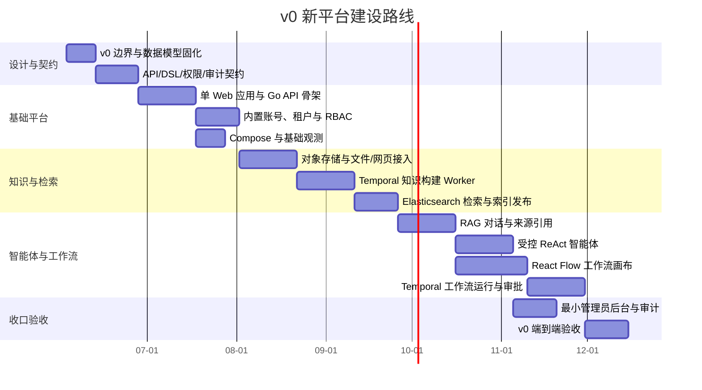

# v0 新平台建设计划

> 本计划面向从零建设的新平台，不再使用“重构”口径。v0 目标是交付一个可用的智能体知识平台 MVP：单 Next.js Web、Go 模块化单体、Python AI Worker、Temporal 统一执行引擎、PostgreSQL、Elasticsearch、Redis 和 MinIO。

## 1. v0 总体目标

v0 必须交付一个可运行、可演示、可继续扩展的最小闭环：

```text
内置账号 -> 个人/租户空间 -> 知识材料接入 -> Temporal 知识构建
-> Elasticsearch 关键词/向量检索 -> RAG 对话 -> ReAct 智能体
-> React Flow 可视化工作流 -> 审计/Trace/最小管理员后台
```

v0 明确不做：

- 公开 Open API/SDK。
- 完整 MCP/第三方插件市场。
- 完整系统运维 Web 端。
- PostgreSQL Patroni/同步复制/多从 HA。
- Kubernetes 生产治理作为验收门槛。
- 企业 SSO/OIDC/MFA。
- 复杂 ABAC、部门、岗位、字段级权限。
- 多模型供应商路由和租户自带 key。

## 2. v0 路线



## 3. 阶段一：v0 边界与契约固化

### 3.1 目标

固化 v0 首版边界，避免平台第一版被 Open API、MCP 市场、完整运维台、PG HA 和 K8s 治理拖大。

### 3.2 工作内容

- 明确 v0 用户类型：个人用户、租户管理员、租户成员、平台管理员。
- 明确 v0 权限：最小 RBAC + 知识库级 `owner/admin/editor/viewer`。
- 明确 v0 服务形态：单 Next.js、Go 模块化单体、Python AI Worker、Temporal、PostgreSQL、Elasticsearch、Redis、MinIO。
- 定义 Workflow DSL，不把 React Flow JSON 作为后端执行协议。
- 定义 ReAct Action 边界：RAG Retrieve、LLM、HTTP Request、Final Answer。
- 定义工作流节点边界：Start、End、LLM、RAG Retrieve、ReAct Agent、HTTP Request、Condition、Human Approval。
- 定义 Elasticsearch 切片字段和权限过滤下推规则。
- 定义文件接入范围和网页抓取 robots.txt 合规规则。

### 3.3 交付物

- v0 架构说明。
- v0 功能边界说明。
- 数据模型草案。
- Workflow DSL 草案。
- ReAct Action 协议草案。
- 权限矩阵草案。
- 审计事件清单。

### 3.4 验收标准

- 所有 v0/v1+ 边界清晰。
- Workflow DSL 可以驱动后端执行，不依赖前端画布内部结构。
- ES 权限字段和查询过滤规则明确。
- ReAct 与工作流节点都有限制条件和安全边界。

## 4. 阶段二：基础平台

### 4.1 目标

搭建可运行的基础平台骨架，完成账号、租户、权限、会话、基础路由、Compose 和基础观测。

### 4.2 工作内容

- 建设单个 Next.js Web 应用：
  - `/app` 普通使用区。
  - `/tenant` 租户管理区。
  - `/admin` 最小管理员后台。
- 建设 Go 模块化单体 API：
  - 账号与会话模块。
  - 租户与成员模块。
  - RBAC 与知识库权限模块。
  - 知识库元数据模块。
  - 工作流/智能体定义模块。
  - Temporal client 模块。
  - 审计模块。
- 建设 PostgreSQL 初始 schema 和迁移机制。
- 建设 Redis 会话和短 TTL 状态封装。
- 建设 Docker Compose，启动 Web、Go API、Python Worker、Temporal、PostgreSQL、Elasticsearch、Redis、MinIO。
- 接入基础日志、TraceId 和健康检查。

### 4.3 交付物

- Web 应用骨架。
- Go API 骨架。
- PostgreSQL schema 和迁移。
- Compose 配置。
- 基础鉴权和 RBAC。
- 基础审计和健康检查。

### 4.4 验收标准

- 用户可登录、退出、会话过期。
- 租户管理员可邀请成员。
- 平台管理员可查看用户和租户。
- Compose 可启动核心组件。
- Go API 请求带 TraceId。

## 5. 阶段三：知识库与检索

### 5.1 目标

完成知识材料接入、Temporal 知识构建和 Elasticsearch 检索索引发布。

### 5.2 工作内容

- 支持 PDF、Markdown、TXT、DOCX、CSV、XLSX、HTML、PPTX 上传。
- 支持单 URL HTML 抓取，并遵守 robots.txt。
- 文件进入 S3 兼容对象存储，Compose 默认 MinIO。
- Python AI Worker 实现解析、清洗、切片、Embedding。
- Temporal 编排知识构建 workflow。
- Elasticsearch 写入文本和 embedding。
- 实现索引版本和 alias 发布。
- PostgreSQL 保存知识库、文档、切片元数据、任务状态、权限主数据和索引版本。
- ES 查询阶段下推权限过滤。

### 5.3 交付物

- 文件/网页接入接口。
- 知识构建 workflow。
- Python 解析与 Embedding Worker。
- Elasticsearch 索引 mapping。
- 索引 alias 发布机制。
- ES 权限过滤测试。

### 5.4 验收标准

- 支持范围内文件可上传并异步构建。
- 网页抓取遵守 robots.txt。
- 构建失败可重试。
- 已发布索引版本可用于检索。
- 未授权知识库切片不会被 ES 查询召回。

## 6. 阶段四：RAG 对话

### 6.1 目标

完成基于授权知识库的 RAG 对话、来源引用、多轮会话和反馈。

### 6.2 工作内容

- 用户选择授权知识库。
- 执行关键词召回和向量召回。
- 权限过滤下推到 ES query/filter。
- 上下文裁剪。
- 调用平台级主 LLM。
- 返回答案和来源引用。
- 支持多轮会话。
- 记录反馈、审计、TraceId、Token、耗时和错误码。

### 6.3 交付物

- RAG 对话页面。
- RAG 后端接口。
- Python RAG 执行逻辑。
- 来源引用组件。
- RAG 审计和指标。

### 6.4 验收标准

- 用户只能检索授权知识库。
- 回答必须带来源引用。
- 无权文档不会通过引用、摘要或统计泄漏。
- RAG 链路可追踪到 ES 查询和模型调用。

## 7. 阶段五：受控 ReAct 智能体

### 7.1 目标

建设基于 ReAct 的受控智能体，支持有限 Action 和可靠执行。

### 7.2 工作内容

- 智能体草稿、发布版本和停用。
- 运行实例绑定发布版本。
- 支持 Action：RAG Retrieve、LLM、HTTP Request、Final Answer。
- HTTP Request 支持 allowlist、参数 schema、响应大小限制、超时和审计。
- 高风险 HTTP 请求进入 Human Approval。
- 支持 `max_steps`、单步超时、总超时、Token 预算和失败停止策略。
- Temporal 记录每一步 Thought/Action/Observation 摘要。

### 7.3 交付物

- 智能体配置页面。
- 智能体发布版本模型。
- ReAct workflow。
- Action 协议。
- 运行日志和审计。

### 7.4 验收标准

- 智能体可基于授权知识库完成受控问答。
- Action 超出允许范围时被拒绝。
- HTTP Request 受 allowlist 和 schema 限制。
- 超过 `max_steps` 或超时后停止。
- 运行历史可审计和追踪。

## 8. 阶段六：React Flow 工作流

### 8.1 目标

建设可视化自由编排工作流，但限制节点类型，使用 Temporal 执行。

### 8.2 工作内容

- React Flow 画布。
- 平台自定义 Workflow DSL。
- 草稿、发布版本、停用版本。
- 单人编辑锁和乐观锁。
- 支持节点：Start、End、LLM、RAG Retrieve、ReAct Agent、HTTP Request、Condition、Human Approval。
- 后端校验 DSL。
- Temporal 执行 workflow。
- Human Approval 暂停和恢复。
- 节点输入/输出摘要、状态、耗时、错误、TraceId。

### 8.3 交付物

- 工作流画布页面。
- Workflow DSL schema。
- DSL 校验器。
- 工作流发布版本模型。
- Temporal workflow runner。
- Human Approval 页面或操作入口。

### 8.4 验收标准

- 用户可编辑、保存、发布、运行工作流。
- 运行实例绑定发布版本。
- 修改草稿不影响历史运行。
- Human Approval 可暂停和恢复。
- 后端执行不依赖 React Flow 内部 JSON。

## 9. 阶段七：最小管理员后台与 v0 验收

### 9.1 目标

完成平台最小运营能力和 v0 端到端验收。

### 9.2 工作内容

- 用户、租户、知识库、任务、审计列表。
- 任务失败重试/取消。
- 服务健康页。
- Temporal UI、Grafana、Tempo 等外部链接。
- v0 端到端验收用例。
- 基础安全检查。
- Compose 部署说明。

### 9.3 交付物

- 最小管理员后台。
- v0 验收报告。
- Compose 部署文档。
- 数据备份说明。
- v1+ 后续路线。

### 9.4 验收标准

- v0 最小闭环端到端通过。
- 管理员可定位失败任务并重试/取消。
- 审计覆盖关键操作。
- 核心链路具备 TraceId 和基础指标。
- Compose 环境可复现启动。

## 10. v1+ 后续路线

| 能力 | 建议阶段 | 说明 |
| --- | --- | --- |
| 公开 Open API/SDK | v1 | 开发者应用、签名、防重放、SDK、契约测试 |
| MCP/第三方插件市场 | v1/v2 | 工具注册、授权、凭证治理、用户自定义 MCP |
| 企业 SSO/OIDC/MFA | v1 | 企业身份集成 |
| 完整运维控制台 | v1/v2 | K8s、发布回滚、告警路由、容量治理 |
| PostgreSQL HA | v2 | Patroni、同步复制、多从、故障切换演练 |
| Kubernetes 生产治理 | v2 | HPA、PDB、灰度、蓝绿、资源隔离 |
| 复杂权限 | v2 | 部门、岗位、字段级、标签级 ABAC |
| 多模型/BYOK | v2 | 多供应商路由、租户自带 key、成本优化 |

## 11. 风险与控制

| 风险 | 控制措施 |
| --- | --- |
| v0 范围再次膨胀 | v0 只验收本文明确列出的能力，Open API、MCP 市场、完整运维台和 PG HA 全部后置。 |
| ReAct 变成开放执行器 | Action 限制为 RAG Retrieve、LLM、HTTP Request、Final Answer，HTTP 受 allowlist/schema/审计控制。 |
| 工作流复杂度失控 | v0 只支持 8 类节点，不做循环、并行、子工作流、自定义代码。 |
| 检索权限泄漏 | 权限过滤必须下推到 Elasticsearch query/filter，召回后只做二次校验。 |
| 网页抓取变成爬虫平台 | v0 只做单 URL HTML 抓取，遵守 robots.txt，不做递归、登录态、JS 渲染或反爬绕过。 |
| 部署复杂度过高 | Compose 必交付，Kubernetes 仅可选基线。 |
| 数据层 HA 过早拖慢 v0 | PG v0 单主可迁移，备份和迁移必须做好，HA 放 v2。 |
